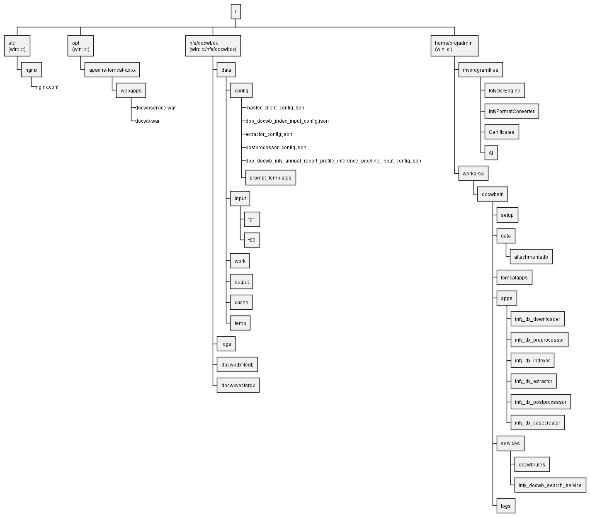
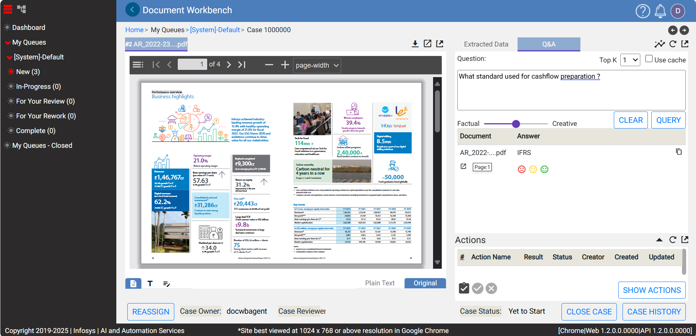
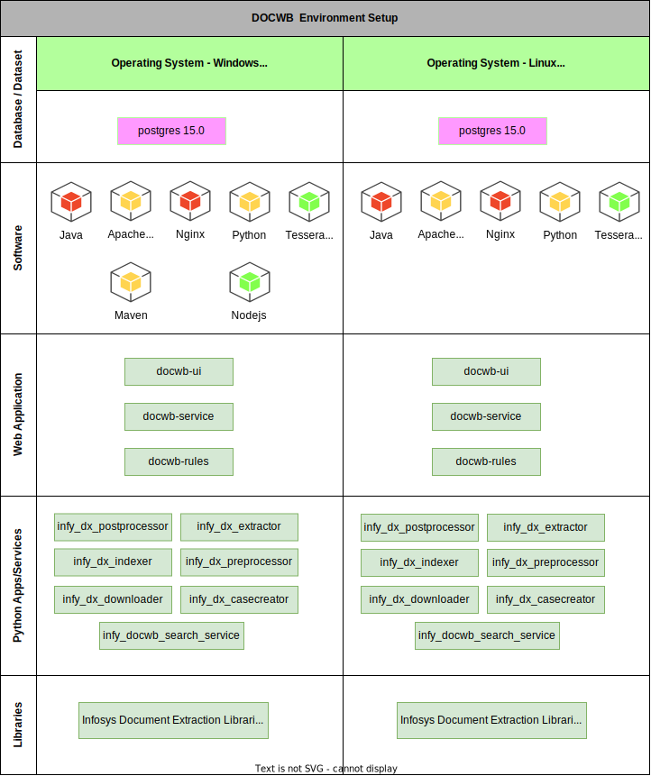

Installation
=============
.. Note::
    This section provides information on how to install the necessary software, build and deploy the solution.

1. Create Folder Structure
^^^^^^^^^^^^^^^^^^^^^^^^^^^^^^

Run the script to create the necessary folders.

.. tab:: Windows PowerShell

    .. code-block:: bash
        
        python C:\InfyDocWb\tools\python\batch_extractor\create_directories.py

.. tab:: Linux
    
    .. code-block:: bash

        # Copy from C:\InfyDocWb\tools\python\batch_extractor\create_directories.py
        # To /tmp/InfyDocWb/tools/python/batch_extractor/create_directories.py
        sudo python /tmp/InfyDocWb/tools/python/batch_extractor/create_directories.py

.. Note::
    The following folder structure is created.

      
2. Apache Tomcat Configuration
^^^^^^^^^^^^^^^^^^^^^^^^^^^^^^

.. Note::
    Assumption is that Apache Tomcat is installed at `C:\\ProgramFiles\\apache-tomcat-9.0.98`    

2.1. Setup as automated service
~~~~~~~~~~~~~~~~~~~~~~~~~~~~~~~

.. tab:: Windows PowerShell

    .. code-block:: bash

        Not Applicable

.. tab:: Linux

    .. code-block:: bash

        # Download apache-tomcat-9.0.98 and move to /opt/ folder
        # copy from C:\InfyDocWb\components\middleware\tomcat\tomcat.dev.service 
        # To /home/projadmin/workarea/docwbsln/setup  
        # Verify tomcat path in the tomcat.dev.service file is correct.       
        sudo cp /home/projadmin/workarea/docwbsln/setup/tomcat.dev.service /etc/systemd/system/tomcat.service             
        sudo cat /etc/systemd/system/tomcat.service
        sudo systemctl enable tomcat.service
        sudo systemctl daemon-reload
        sudo systemctl start tomcat.service
        sudo systemctl status tomcat.service
        # To verify - http://<hostname/ip-addes>:8080/

        # If you need to allow traffic through port 8080 and are behind a firewall, please ensure that port 8080 is enabled. 
        # Allow through firewall
        sudo firewall-cmd --list-ports
        # none 
        sudo firewall-cmd --zone=public --add-port=8080/tcp --permanent
        sudo firewall-cmd --reload
        sudo firewall-cmd --list-ports
        # 8080/tcp

        

3. Nginx Configuration
^^^^^^^^^^^^^^^^^^^^^^

.. Note::
    Assumption is that Nginx is installed at `C:\\ProgramFiles\\nginx-1.27.3`    

3.1. Create SSL certificate
~~~~~~~~~~~~~~~~~~~~~~~~~~~

.. tab:: Windows PowerShell

    .. code-block:: bash

        Not Applicable
    
.. tab:: Linux

    .. code-block:: bash

        # Copy C:/InfyDocWb/tools/LinuxScripts/certificate-generator.sh
        # to /tmp/certificates/
        cd /tmp/certificates/
        sh certificate-generator.sh
        ls -l /tmp/certificates/
        # Move the 4 generated files to the below destination
        mv /tmp/certificates/* /home/projadmin/workarea/docwbsln/setup/certificates
        # Replace your server hostname in place of <hostname> before move.
        mv /home/projadmin/workarea/docwbsln/setup/certificates/<hostname>.cer /etc/pki/tls/certs/
        mv /home/projadmin/workarea/docwbsln/setup/certificates/<hostname>.key /etc/pki/tls/private/
  
3.2. Setup as automated service
~~~~~~~~~~~~~~~~~~~~~~~~~~~~~~~

.. tab:: Windows PowerShell

    .. code-block:: powershell
            
        # Navigate to the directory where nginx.exe is located.
        cd C:\ProgramFiles\nginx-1.27.3  
        # Copy "nginx.local.conf"   
        Copy-Item -Path "C:\InfyDocWB\components\middleware\proxyserver\nginx.local.conf" `
        -Destination "C:\ProgramFiles\nginx-1.27.3\conf\nginx.conf"    
        # To start nginx
        nginx
        # To view status 
        tasklist /FI "IMAGENAME eq nginx.exe"
        # To stop nginx
        nginx -s stop

.. tab:: Linux

    .. code-block:: bash

        # Copy C:\InfyDocWb\components\middleware\proxyserver\nginx.dev.conf
        # To /home/projadmin/workarea/docwbsln/setup/

        # Update "nginx.dev.conf" with below details and replace <hostname> with your hostname.
        # server_name  <hostname>;
        # ssl_certificate /etc/pki/tls/certs/<hostname>.cer;
        # ssl_certificate_key /etc/pki/tls/private/<hostname>.key;
        sudo cp /home/projadmin/workarea/docwbsln/setup/nginx.dev.conf /etc/nginx/nginx.conf
        sudo systemctl enable nginx
        sudo systemctl start nginx
        sudo systemctl status nginx
        #SELinux command to access the directory for future use
        sudo chcon -R -t httpd_sys_content_t /home/projadmin/workarea/docwbsln/data/attachmentsdb
        sudo systemctl restart nginx
        

        # Allow firewall
        sudo firewall-cmd --permanent --zone=public --add-service=http
        sudo firewall-cmd --zone=public --add-port=443/tcp --permanent
        # success

        sudo firewall-cmd --reload

        sudo firewall-cmd --list-ports
        # 443/tcp 8080/tcp

        # To verify - http://<hostname>/

        # Update permissions
        sudo chown -R projadmin:projadmin /var/lib/nginx
        sudo chown -R projadmin:projadmin /var/log/nginx
        sudo systemctl restart nginx.service

        #SELinux booleans
        getsebool httpd_can_network_connect
        # httpd_can_network_connect --> off

        sudo setsebool -P httpd_can_network_connect 1

        getsebool httpd_can_network_connect
        # httpd_can_network_connect --> on
        getsebool httpd_use_nfs
        # httpd_use_nfs --> off

        sudo setsebool -P httpd_use_nfs 1

        getsebool httpd_use_nfs
        # httpd_use_nfs --> on
        getsebool httpd_can_network_relay
        # httpd_can_network_relay --> off

        sudo setsebool -P httpd_can_network_relay 1

        getsebool httpd_can_network_relay
        # httpd_can_network_relay --> on

4. Database Setup
^^^^^^^^^^^^^^^^^
Database credentials: (sample given below is typical of a database)

+---------------------+------------+
| db_server_hostname  | localhost  |
+---------------------+------------+
| db_server_port      | 5432       |
+---------------------+------------+
| db_name             | postgres   |
+---------------------+------------+
| db_username         | postgres   |
+---------------------+------------+
| db_password         | \*\*\*\*\* |
+---------------------+------------+

*Verify* the connection to the database.

.. tab:: Windows PowerShell

    .. code-block:: powershell

        psql -h localhost -p 5432 -d postgres -U postgres -c "SELECT version();"
        
        # Password for user postgres:

        # version
        # --------------
        # PostgreSQL 15.10 on ...
        # (1 row)

.. tab:: Linux

    .. code-block:: bash

        #Allow through firewall
        sudo firewall-cmd --list-ports     
        sudo firewall-cmd --zone=public --add-port=5432/tcp --permanent
        # success
        sudo firewall-cmd --reload
        # success
        sudo firewall-cmd --list-ports
        # 443/tcp 5432/tcp 8080/tcp

        #Create a new database (mandatory before starting the service first time)
        sudo postgresql-setup --initdb
        #Change postgres UNIX account password
        id postgres
        # uid=26(postgres) gid=26(postgres) groups=26(postgres)
        sudo passwd postgres
        # Provide a secure password and NOTE IT DOWN somewhere securely.

        #Enable and start service
        systemctl status postgresql.service
        sudo systemctl enable postgresql.service
        sudo systemctl start postgresql.service
        sudo systemctl status postgresql.service

        #Change postgres DB account password
        sudo su - postgres
        id
        # Replace <Provide a secure password> with password
        psql -c "alter user postgres with password '<Provide a secure password>' "
        exit
        # logout

        #Configure database properties
        sudo su - postgres
        cd /var/lib/pgsql/data
        ls -l *.conf
        #Change listen address to host system IP, max connections and shared buffer
        ping `hostname`
        # PING <hostname> (<IP address>) 56(84) bytes of data.
        vi postgresql.conf
        # Add below lines to the file after replacing <IP address> and save 

        # Modified
        listen_addresses = '<IP address>'
        # Modified
        max_connections = 200
        # Modified
        shared_buffers =512MB

        #Allow access from systems
        vi pg_hba.conf
        # Add below line to the file and save 

        # Added
        host     all             all             0.0.0.0/0               md5

        
        # Now Restart service
        exit
        sudo systemctl restart postgresql.service

        
        #Verification
        psql -U postgres -h `hostname` -p 5432
        #Password for user postgres:
        #psql (15.12)

        #psql -h `hostname` -p 5432 -d postgres -U postgres -c "SELECT version();"

        

*Update* the values using the ``Local Cache Manager`` utility provided with the setup.

.. tab:: Windows PowerShell

    .. code-block:: powershell

        python C:\InfyDocWb\_internal\scripts\local_cache\local_cache_manager.py `
        -c C:\InfyDocWb\_internal\scripts\local_cache\lcm_idw_setup_config.json
    
Run the below commands in the terminal to setup the database.

.. tab:: Windows PowerShell

    .. code-block:: powershell

        # Copy sql files to the destination folder
        Get-ChildItem -Path `
        "C:\InfyDocWb\components\java\DocWorkbenchServiceWAR\src\main\resources\db" `
        -Filter *.sql -Recurse |
        Copy-Item -Force -Destination `
        (New-Item -Type Directory -Force "C:\workarea\docwbsln\setup\db\sql\docwbmain") 

        Get-ChildItem -Path `
        "C:\InfyDocWb\components\java\DocWorkbenchEngineCoreJAR\src\main\resources" `
        -Filter *.sql -Recurse |
        Copy-Item -Force -Destination `
        (New-Item -Type Directory -Force "C:\workarea\docwbsln\setup\db\sql\workflow") 

    .. code-block:: powershell

        # Execute the script to setup database
        # Update CONFIG_DATA in below script with "postgresHostIPAddress": "localhost" and password.
        python "C:\InfyDocWb\tools\python\batch_extractor\database_setup_postgres.py" `
        --action "newdb" --sql_dir_path "C:\workarea\docwbsln\setup\db\sql"

.. tab:: Linux

    .. code-block:: bash

        mkdir -p /home/projadmin/workarea/docwbsln/setup/db/ddl/main/docwbmain        
        # Copy all sql files from C:\InfyDocWb\components\java\DocWorkbenchServiceWAR\src\main\resources\db
        # To /home/projadmin/workarea/docwbsln/setup/db/ddl/main/docwbmain
        mkdir -p /home/projadmin/workarea/docwbsln/setup/db/ddl/main/workflow
        # Copy all sql files from C:\InfyDocWb\components\java\DocWorkbenchEngineCoreJAR\src\main\resources
        # To /home/projadmin/workarea/docwbsln/setup/db/ddl/main/workflow

        # Update CONFIG_DATA in below script with "postgresHostIPAddress": "<hostname>" and password.
        # Ensure psql_path is correct in script.
        # Copy C:\InfyDocWb\tools\python\batch_extractor\database_setup_postgres.py 
        # To /home/projadmin/workarea/docwbsln/setup/db

        # Execute the script to setup database        
        cd /home/projadmin/workarea/docwbsln/setup/db
        python database_setup_postgres.py --action "newdb" --sql_dir_path "/home/projadmin/workarea/docwbsln/setup/db/ddl/main"

Note down the ``New TenantId`` generated after the successful database setup, using the ``Local Cache Manager`` utility.

.. tab:: Windows PowerShell

    .. code-block:: bash

        python C:\InfyDocWb\_internal\scripts\local_cache\local_cache_manager.py `
        -c C:\InfyDocWb\_internal\scripts\local_cache\lcm_idw_setup_config.json

If facing any issue with ``uuid-ossp`` extension creation, follow below instruction.

.. tab:: Windows PowerShell

    .. code-block:: bash

        cd C:\Program Files\PostgreSQL\15\bin
        psql -U postgres -d your_database
        CREATE EXTENSION IF NOT EXISTS "uuid-ossp";

.. tab:: Linux

    .. code-block:: bash

        sudo yum update -y
        sudo yum install -y postgresql-contrib

5. Build Application
^^^^^^^^^^^^^^^^^^^^

5.1. Build Docwb UI Application
~~~~~~~~~~~~~~~~~~~~~~~~~~~~~~~

First, install the necessary packages globally. This is a one-time setup.

.. tab:: Windows PowerShell

    .. code-block:: bash

        npm install -g pnpm

Next, install the necessary packages at the project level. This is a one-time setup.

.. tab:: Windows PowerShell

    .. code-block:: bash

        cd C:\InfyDocWb\components\java\DocWorkbenchUIWAR\src\main\angular
        pnpm install

.. Note::
    Ensure ``\node_modules`` folder is created successfully.

Next, update the new tenant id in the configuration file.

.. tab:: Windows PowerShell

    .. code-block:: bash
        
        cd C:\InfyDocWb\components\java\DocWorkbenchUIWAR\src\main\angular
        
        $get_tenant_id=python C:\InfyDocWB\_internal\scripts\local_cache\local_cache_util.py get -b infydocwb_setup -k tenant_id
        $tenant_id_clean = $get_tenant_id -replace '\e\[[0-9;]*m', ''
        $tenant_id = $tenant_id_clean.split("=")[1].Trim()
        $tenant_id
        node update-config.js "conf/test/config-data.json" "$tenant_id"

        # For linux machine build, update dev config-data.json
        # node update-config.js "conf/dev/config-data.json" "$tenant_id"

Next, build the angular application.

.. tab:: Windows PowerShell

    .. code-block:: bash

        cd C:\InfyDocWb\components\java\DocWorkbenchUIWAR\src\main\angular
        npm run build

Ensure ``\dist`` folder is created successfully.

Finally, build the java application which will include the angular application.

.. tab:: Windows PowerShell
    
    .. code-block:: powershell

        # Select 11B to build the project DocWorkbenchUIWAR for Windows 
        # Or select 11C for Linux
        cd C:\InfyDocWb\components\java             
        .\JavaManager.ps1

        # Select Q to exit the script
   
Verify WAR file created under the target folder of DocWorkbenchUIWAR module.

5.2. Build Docwb Service Application
~~~~~~~~~~~~~~~~~~~~~~~~~~~~~~~~~~~~

First, update the DB connection string in the configuration file.

.. tab:: Windows PowerShell

    .. code-block:: bash
           
        $get_dbserver=python C:\InfyDocWB\_internal\scripts\local_cache\local_cache_util.py get -b infydocwb_setup -k db_server_hostname
        $dbserver_clean = $get_dbserver -replace '\e\[[0-9;]*m', ''
        $db_server_hostname = $dbserver_clean.split("=")[1].Trim()
        $db_server_hostname
        
        $config_file_path = "C:\InfyDocWb\components\java\DocWorkbenchServiceWAR\src\main\resources\conf\test\application.properties"
        # For linux machine build, change $config_file_path to dev folder's application.properties
        # $config_file_path = "C:\InfyDocWb\components\java\DocWorkbenchServiceWAR\src\main\resources\conf\dev\application.properties"
        
        python C:\InfyDocWB\_internal\scripts\config_file_updater\config_file_updater.py `
        --config_file_path `
        $config_file_path `
        --key "jdbc.url" `
        --value `
        "jdbc:postgresql://$($db_server_hostname):5432/docwbdb?currentSchema=docwbmain&ApplicationName=DocwbService"
        
Next, update the tenant Id in the configuration file.     

.. tab:: Windows PowerShell

    .. code-block:: bash
           
        $get_tenant_id=python C:\InfyDocWB\_internal\scripts\local_cache\local_cache_util.py get -b infydocwb_setup -k tenant_id
        $tenant_id_clean = $get_tenant_id -replace '\e\[[0-9;]*m', ''
        $tenant_id = $tenant_id_clean.split("=")[1].Trim()
        $tenant_id      

        $config_file_path = "C:\InfyDocWB\components\java\DocWorkbenchServiceWAR\src\main\resources\conf\test\idmsConfig.json"
        # For linux machine build, change $config_file_path to dev folder's idmsConfig.json
        # $config_file_path = "C:\InfyDocWB\components\java\DocWorkbenchServiceWAR\src\main\resources\conf\dev\idmsConfig.json"

        python C:\InfyDocWB\_internal\scripts\config_file_updater\config_file_updater.py `
        --config_file_path `
        $config_file_path `
        --token '<TenantId>' `
        --value `
        "$($tenant_id)"

Next, build the java application.

.. tab:: Windows PowerShell
    
    .. code-block:: powershell

        # Select 12B to build the project DocWorkbenchServiceWAR for Windows 
        # or select 12C for Linux
        cd C:\InfyDocWb\components\java             
        .\JavaManager.ps1

        # Select Q to exit the script

5.3. Build Docwb Rules Application
~~~~~~~~~~~~~~~~~~~~~~~~~~~~~~~~~~~~

.. tab:: Windows PowerShell
    
    .. code-block:: powershell

        # Select 13B to build the project DocWorkbenchRulesWAR for Windows 
        # or select 13C for Linux
        cd C:\InfyDocWb\components\java             
        .\JavaManager.ps1

        # Select Q to exit the script

5.4. Build Docwb Engine Application
~~~~~~~~~~~~~~~~~~~~~~~~~~~~~~~~~~~~

.. tab:: Windows PowerShell
    
    .. code-block:: powershell

        # Select 15B to build the project DocWorkbenchEngine2WAR for Windows 
        # or select 15C for Linux
        cd C:\InfyDocWb\components\java             
        .\JavaManager.ps1

        # Select Q to exit the script

6. Deploy Application
^^^^^^^^^^^^^^^^^^^^^^

.. Note::
    Assumption is that Apache Tomcat is installed at `C:\\ProgramFiles\\apache-tomcat-9.0.98`    

6.1. Deploy Docwb UI Application
~~~~~~~~~~~~~~~~~~~~~~~~~~~~~~~

.. tab:: Windows PowerShell
    
    .. code-block:: powershell

        Copy-Item -Path "C:\InfyDocWb\components\java\DocWorkbenchUIWAR\target\docwb.war" `
        -Destination "C:\ProgramFiles\apache-tomcat-9.0.98\webapps"

.. tab:: Linux

    .. code-block:: bash

        cd /home/projadmin/workarea/docwbsln/tomcatapps
        # Copy below executable war  to /home/projadmin/workarea/docwbsln/tomcatapps.
        # C:\InfyDocWb\components\java\DocWorkbenchUIWAR\target\docwb.war

6.2. Deploy Docwb Service Application
~~~~~~~~~~~~~~~~~~~~~~~~~~~~~~~~~~~~

.. tab:: Windows PowerShell
    
    .. code-block:: powershell

        Copy-Item -Path `
        "C:\InfyDocWb\components\java\DocWorkbenchServiceWAR\target\docwbservice.war" `
        -Destination "C:\ProgramFiles\apache-tomcat-9.0.98\webapps"

.. tab:: Linux

    .. code-block:: bash

        cd /home/projadmin/workarea/docwbsln/tomcatapps
        # Copy below executable war  to /home/projadmin/workarea/docwbsln/tomcatapps.
        # C:\InfyDocWb\components\java\DocWorkbenchServiceWAR\target\docwbservice.war

**Start the Application**

.. tab:: Windows PowerShell

    .. code-block:: powershell

        # Start the server
        cd C:\ProgramFiles\apache-tomcat-9.0.98\bin\
        .\startup.bat
        # If you see any error in the startup logs.
        .\shutdown.bat        
        # Verify UI is up and running by - http://localhost:8080/docwb in browser.

.. tab:: Linux
    
    .. code-block:: bash

        #start the server
        cp -r /home/projadmin/workarea/docwbsln/tomcatapps/* /opt/apache-tomcat-9.0.98/webapps/
        # Provide necessary permissions to the copied files
        cd /opt/apache-tomcat-9.0.98/webapps
        sudo systemctl restart tomcat.service
        sudo systemctl status tomcat.service
        # Manually update below files configuration details like tenantId, serviceUrl.
        # Update serviceUrl in application.properties e.g.http://<hostname>:80/docwbservice
        /opt/apache-tomcat-9.0.98/webapps/docwb/WEB-INF/classes/application.properties
        # Update serviceBaseUrl and modelServiceUrl e.g. "http://<hostname>:80/docwbservice, http://<hostname>:8003
        /opt/apache-tomcat-9.0.98/webapps/docwb/static/assets/config-data.json
        # Verify tenantId in idmsConfig.json
        /opt/apache-tomcat-9.0.98/webapps/docwbservice/WEB-INF/classes/idmsConfig.json
        sudo systemctl restart tomcat.service
        # Verify UI is up and running by - http://<hostname>:8080/docwb in browser.

**Service Rule Setup**

.. tab:: Windows PowerShell
    
    .. code-block:: powershell
        
        # Create necessary folder
        New-Item -ItemType Directory -Path "C:\workarea\docwbsln\services\docwbrules\config"
    
    .. code-block:: powershell

        # Copy configuration files and executable war
        Copy-Item -Path `
        "C:\InfyDocWb\components\java\DocWorkbenchRulesWAR\target\EXECUTABLE\*" `
        -Destination "C:\workarea\docwbsln\services\docwbrules\" `
        -Recurse -Force

    .. code-block:: powershell

        # Copy bat file to start the service
        Copy-Item -Path `
        "C:\InfyDocWb\components\java\DocWorkbenchRulesWAR\docwbrules.bat" `
        -Destination "C:\workarea\docwbsln\services\docwbrules\" `
        -Force

    .. code-block:: powershell

        $get_tenant_id=python C:\InfyDocWB\_internal\scripts\local_cache\local_cache_util.py get -b infydocwb_setup -k tenant_id
        $tenant_id_clean = $get_tenant_id -replace '\e\[[0-9;]*m', ''
        $tenant_id = $tenant_id_clean.split("=")[1].Trim()
        $tenant_id
        # Updates with the new tenant id
        cd C:\workarea\docwbsln\services\docwbrules\config\rules\action
        ren "9acb0d4c-f516-403c-bdae-d738ac66d2b2" "$tenant_id"
        cd ..\attribute\
        ren "9acb0d4c-f516-403c-bdae-d738ac66d2b2" "$tenant_id"
        cd ..\template\
        ren "9acb0d4c-f516-403c-bdae-d738ac66d2b2" "$tenant_id"

    .. code-block:: powershell

        cd C:\workarea\docwbsln\services\docwbrules
        .\docwbrules.bat
        # Check the logs to ensure the service is running without error. 
        # C:\workArea\docwbsln\logs

.. tab:: Linux

    .. code-block:: bash
        
        # Copy below executable war,config folder & service file 
        # to /home/projadmin/workarea/docwbsln/services/docwbrules.
        # C:\InfyDocWb\components\java\DocWorkbenchRulesWAR\target\EXECUTABLE\config
        # C:\InfyDocWb\components\java\DocWorkbenchRulesWAR\target\EXECUTABLE\docwb-rules.war
        # C:\InfyDocWb\components\java\DocWorkbenchRulesWAR\docwbrules.dev.service
        
    .. code-block:: bash

        cd /home/projadmin/workarea/docwbsln/services/docwbrules/
        mv docwbrules.dev.service docwbrules.service
        
    .. code-block:: powershell

        # Updates <TenantId> with the new tenant id
        cd /home/projadmin/workarea/docwbsln/services/docwbrules/config/rules/action
        mv 9acb0d4c-f516-403c-bdae-d738ac66d2b2 <TenantId>
        cd ../attribute
        mv 9acb0d4c-f516-403c-bdae-d738ac66d2b2 <TenantId>
        cd ../template
        mv 9acb0d4c-f516-403c-bdae-d738ac66d2b2 <TenantId>
    
    .. code-block:: bash

        # To Start the docwbrules service
        cd /home/projadmin/workarea/docwbsln/services/docwbrules
        sudo cp docwbrules.service /etc/systemd/system/docwbrules.service
        sudo systemctl enable docwbrules.service
        sudo systemctl daemon-reload
        sudo systemctl start docwbrules.service
        sudo systemctl status docwbrules.service
        # Check the logs to ensure the service is running without error.
           
**Create Admin User account**

.. 1. Open link in browser - http://localhost:8080/docwb/#/registration

1. Open link in browser - |location_link|
   
   Ensure to replace the localhost with hostname where the application is deployed. 
   
   i.e. ``http://<hostname>/docwb/#/registration``

.. |location_link| raw:: html

   <a href="http://localhost:80/docwb/#/registration" target="_blank">http://localhost:80/docwb/#/registration</a>

2. Fill out the form as shown in the example below.
   
    .. list-table::
      :header-rows: 1

      * - **Field**
        - **Details**
      * - Full Name
        - admin
      * - Email Id
        - admin@office.com
      * - Login Id
        - admin
      * - User Type
        - User
      * - Password
        - `*****`

3. Click the ``Sign Up`` button. You will see the following success message. ``User admin registered successfully``

4. Executes below script for the first user setup.

.. tab:: Windows PowerShell
    
    .. code-block:: powershell
        
        python "C:\InfyDocWb\tools\python\batch_extractor\database_setup_postgres.py" `
        --action "newuser" `
        --sql_file_path "C:\workarea\docwbsln\setup\db\sql\docwbmain\dbDataFirstUserSetup.sql"

.. tab:: Linux

    .. code-block:: bash

        cd /home/projadmin/workarea/docwbsln/setup/db

        python database_setup_postgres.py --action "newuser" \
        --sql_file_path "/home/projadmin/workarea/docwbsln/setup/db/ddl/main/docwbmain/dbDataFirstUserSetup.sql"

5. We need to make user account enable and to provide user role as admin by executing above queries.

6. Now, log in to the application using the registered user's credentials.

   `http://<hostname/ip-address>:80/docwb`
   
   i.e. ``http://localhost:80/docwb``

**Create Agent and Service User accounts**

1. Open link in browser - |location_link|

.. |location_link| raw:: html

   <a href="http://localhost:80/docwb/#/registration" target="_blank">http://localhost:80/docwb/#/registration</a>

2. Fill out the form as shown in the example below.
   
    .. list-table::
      :header-rows: 1

      * - **Field**
        - **Details**
        - **Details**
        - **Details**
      * - Full Name
        - docwbagent
        - dxcasecreator
        - docwbengine
      * - Email Id
        - docwbagent@office.com
        - dxcasecreator@office.com
        - docwbengine@office.com
      * - Login Id
        - docwbagent
        - dxcasecreator
        - docwbengine
      * - User Type
        - User
        - Service
        - Service
      * - Password
        - docwbagent123
        - dxcasecreator123
        - docwbengine123

3. Click the ``Sign Up`` button. You will see the following success message. ``User docwbagent registered successfully.Please wait for admin to approve your registration.``

**Admin User approval to other User** 

1. Login as Admin user, click on ``Manage Users`` under ``Configuration``.   

2. Select the checkbox against the ``docwbagent`` ,
   select ``Enabled`` checkbox and select ``AGENT`` from ``Role`` dropdown, then click on ``SAVE`` button.   

3. Click on ``Show Queues`` and select the checkbox against ``[System]-Default`` for ``docwbagent`` user.   

4. Select the checkbox against the ``dxcasecreator`` user,
   select ``Enabled`` checkbox and select ``SERVICE`` from ``Role`` dropdown, then click on ``SAVE`` button.   

5. Select the checkbox against the ``docwbengine`` user,
   select ``Enabled`` checkbox and select ``SERVICE`` from ``Role`` dropdown, then click on ``SAVE`` button.   

6. Any new user added from the UI should also be manually updated in the below config file. (If already added ignore this step)
   
    .. tab:: Windows PowerShell

        ``C:\ProgramFiles\apache-tomcat-9.0.98\webapps\docwbservice\WEB-INF\classes\idmsConfig.json``  
    
    .. tab:: Linux

        ``/opt/apache-tomcat-9.0.98/webapps/docwbservice/WEB-INF/classes/idmsConfig.json``

    Note: The new user must be added in source code idmsConfig.json file also to prevent data loss from future build of the project.

    e.g. For test environment (windows) at ``C:\InfyDocWB\components\java\DocWorkbenchServiceWAR\src\main\resources\conf\test\idmsConfig.json``,
    For dev environment (linux) at ``C:\InfyDocWB\components\java\DocWorkbenchServiceWAR\src\main\resources\conf\dev\idmsConfig.json``

            .. code-block:: json

                "idmsConfig": {
                    "tenantConfig": [
                        {
                            "tenantIds": [
                                "<TenantId>"
                            ],
                            "dbAuthentication": [
                                "admin",
                                "docwbadmin",
                                "docwbagent",
                                "dxcasecreator",
                                "docwbengine"
                            ],
                            "serviceAccountNames": [
                                "dxcasecreator",
                                "docwbengine"
                            ] 
                                        
                        }
                    ]
                }

7. Stop and start the tomcat server after modifing idmsConfig.json in apache-tomcat's webapps directory.

**Download Models**

.. tab:: Windows PowerShell
    
    .. code-block:: powershell

        # all-MiniLM-L6-v2
        mkdir C:\MyProgramFiles\AI\models
        cd C:\MyProgramFiles\AI\models
        git lfs install
        git clone https://huggingface.co/sentence-transformers/all-MiniLM-L6-v2

    .. code-block:: powershell

        # Yolox - unscructuredio
        mkdir C:\MyProgramFiles\AI\models\unstructuredio
        cd C:\MyProgramFiles\AI\models\unstructuredio
        git lfs install
        git clone https://huggingface.co/unstructuredio/yolo_x_layout

    .. code-block:: powershell

        # tessaract
        mkdir C:\MyProgramFiles\AI\models\tessdata
        cd C:\MyProgramFiles\AI\models\tessdata  
        Invoke-WebRequest -Uri "https://raw.githubusercontent.com/tesseract-ocr/tessdata/main/eng.traineddata" -OutFile "eng.traineddata"
        Invoke-WebRequest -Uri "https://raw.githubusercontent.com/tesseract-ocr/tessdata/main/hin.traineddata" -OutFile "hin.traineddata"
        
    .. code-block:: powershell

        # tiktoken
        mkdir C:\MyProgramFiles\AI\models\tiktoken_encoding
        # Please open tiktoken url 
        # (here https://openaipublic.blob.core.windows.net/encodings/p50k_base.tiktoken) in a browser.
        # it will automatically download a file.
        # Keep that file in "C:\MyProgramFiles\AI\models\tiktoken_encoding"
        # Rename the file with it's hash value i.e. ec7223a39ce59f226a68acc30dc1af2788490e15

    .. code-block:: powershell

        # infy-format-converter
        mkdir C:\MyProgramFiles\InfyFormatConverter
        cd C:\InfyDocWb\components\java\libraries\InfyFormatConverterJAR
        .\BuildJAR.bat
        cd .\target\EXECUTABLE\
        copy .\infy-format-converter-0.0.14.jar C:\MyProgramFiles\InfyFormatConverter\

    .. code-block:: powershell

        # InfyOcrEngine
        mkdir C:\MyProgramFiles\InfyOcrEngine
        cd C:\InfyDocWb\components\java\libraries\InfyOcrEngineJAR
        .\BuildJAR.bat
        cd .\target\EXECUTABLE\
        copy .\infy-ocr-engine-0.0.2.jar C:\MyProgramFiles\InfyOcrEngine

**Build Python Project**

.. code-block:: powershell

    # Build python project - Select E for local environment (windows) 
    # or A for Dev Environment (Linux).

    cd C:\InfyDocWb\components\python\apps\infy_dx_downloader
    .\BuildPackage.bat
    cd ..\infy_dx_indexer\
    .\BuildPackage.bat
    cd ..\infy_dx_preprocessor\
    .\BuildPackage.bat
    cd ..\infy_dx_extractor\
    .\BuildPackage.bat
    cd ..\infy_dx_postprocessor\
    .\BuildPackage.bat
    cd ..\infy_dx_casecreator\
    .\BuildPackage.bat
    cd ..\infy_docwb_search_service\
    .\BuildPackage.bat

7. Document Case Generation
^^^^^^^^^^^^^^^^^^^^^^^^^^^^

.. tab:: Windows PowerShell
    
    .. code-block:: powershell

        # Copy all build python files to destination folder 
        Copy-Item -Path `
        "C:\InfyDocWb\components\python\apps\infy_dx_downloader\target\infy_dx_downloader" `
        -Destination "C:\workarea\docwbsln\apps\infy_dx_downloader" -Recurse -Force

        Copy-Item -Path `
        "C:\InfyDocWb\components\python\apps\infy_dx_indexer\target\infy_dx_indexer" `
        -Destination "C:\workarea\docwbsln\apps\infy_dx_indexer" -Recurse -Force

        Copy-Item -Path `
        "C:\InfyDocWb\components\python\apps\infy_dx_preprocessor\target\infy_dx_preprocessor" `
        -Destination "C:\workarea\docwbsln\apps\infy_dx_preprocessor" -Recurse -Force

        Copy-Item -Path `
        "C:\InfyDocWb\components\python\apps\infy_dx_extractor\target\infy_dx_extractor" `
        -Destination "C:\workarea\docwbsln\apps\infy_dx_extractor" -Recurse -Force

        Copy-Item -Path `
        "C:\InfyDocWb\components\python\apps\infy_dx_postprocessor\target\infy_dx_postprocessor" `
        -Destination "C:\workarea\docwbsln\apps\infy_dx_postprocessor" -Recurse -Force

        Copy-Item -Path `
        "C:\InfyDocWb\components\python\apps\infy_dx_casecreator\target\infy_dx_casecreator" `
        -Destination "C:\workarea\docwbsln\apps\infy_dx_casecreator" -Recurse -Force
        
    .. code-block:: powershell

        # Create virtual environment and install apps
        cd C:\InfyDocWb\tools\python\batch_extractor
        python docwb_install_apps.py

    .. code-block:: powershell

        # For documentworkbench case, keep input file at folder /t02/.
        # e.g. C:/nfs/docwbdx/data/input/t02/AR_2022-23_page-14-17.pdf
        Copy-Item -Path `
        "C:\InfyDocWB\_internal\samples\input\AR_2022-23_page-14-17.pdf" `
        -Destination "C:\nfs\docwbdx\data\input\t02" -Recurse -Force

        # Verify C:/nfs/docwbdx/data/config folder should contain all json and prompt files.
        # If not, copy config folder from C:\InfyDocWb\components\python\apps

.. tab:: Linux

    .. code-block:: bash

        # From target folder of each python project copy project name folder to destination folder.
        # i.e /home/projadmin/workarea/docwbsln/apps/
        # Total 6 folders Refer above - Build Python Project section,
        # (infy_dx_downloader,infy_dx_indexer,infy_dx_preprocessor,
        # infy_dx_extractor,infy_dx_postprocessor,infy_dx_casecreator)
        
        # Copy C:\MyProgramFiles\* to /home/projadmin/myprogramfiles

    .. code-block:: bash

        # Copy C:\InfyDocWb\tools\python\batch_extractor\docwb_install_apps.py
        # To /home/projadmin/workarea/docwbsln/scripts
        # Create virtual environment and install apps
        cd /home/projadmin/workarea/docwbsln/scripts
        python docwb_install_apps.py

    .. code-block:: bash

        # For documentworkbench case, keep input file at folder /t02/.
        # e.g. From C:\InfyDocWB\_internal\samples\input\AR_2022-23_page-14-17.pdf 
        # To /nfs/docwbdx/data/input/t02/AR_2022-23_page-14-17.pdf
        
        # Verify /nfs/docwbdx/data/config folder should contain all json and prompt files.
        # If not, copy config folder from C:\InfyDocWb\components\python\apps\config_dev
        

**Update configuration details in necessary  json files.**

    1. If Tesseract.exe not installed ,then in master_client_config.json update azure_read subscription key, URL and set azure_read true under ocr_tool and others as false at 

        .. tab:: Windows PowerShell

            ``C:\nfs\docwbdx\data\config\master_client_config.json``
        
        .. tab:: Linux

            ``\nfs\docwbdx\data\config\master_client_config.json`` 

        .. code-block:: json

            "default": {
                "ocr_provider_settings": {
                    "tesseract": {},
                    "abbyy": {
                        "customer_project_Id": "",
                        "license_path": "",
                        "license_password": ""
                    },
                    "azure_read": {
                        "subscription_key": "<key>",
                        "url": ""
                    },
                    "azure_ocr": {
                        "subscription_key": "<key>",
                        "url": "<azure_read_url>"
                    }
                },
                "ocr_tool": {
                    "tesseract": {
                        "selected": false,
                        "input_file_type": "image"
                    },
                    "azure_ocr": {
                        "selected": false,
                        "input_file_type": "pdf"
                    },
                    "azure_read": {
                        "selected": true,
                        "input_file_type": "image"
                    }
                }  
            } 
    2. Provide OpenAI URL and key in dpp_docwb_index_input_config.json at 

        .. tab:: Windows PowerShell

            ``C:\nfs\docwbdx\data\config\dpp_docwb_index_input_config.json``

        .. tab:: Linux

            ``\nfs\docwbdx\data\config\dpp_docwb_index_input_config.json``

    3. Provide OpenAI URL and key in all files ending with ``_inference_pipeline_input_config.json``

    4. Provide OpenAI URL and key at 

        .. tab:: Windows PowerShell

            ``C:\nfs\docwbdx\data\config\dpp_docwb_infy_docwb_search_service_processor_input_config.json``
        
        .. tab:: Linux

            ``\nfs\docwbdx\data\config\dpp_docwb_infy_docwb_search_service_processor_input_config.json``
    
    5. Fetch stored tenant id. 

        .. tab:: Windows PowerShell

            .. code-block:: powershell

                $get_tenant_id=python C:\InfyDocWB\_internal\scripts\local_cache\local_cache_util.py get -b infydocwb_setup -k tenant_id
                $tenant_id_clean = $get_tenant_id -replace '\e\[[0-9;]*m', ''
                $tenant_id = $tenant_id_clean.split("=")[1].Trim()
                $tenant_id

    6. Copy above tenant id and update <Tenant_Id> in ``master_client_config.json`` under ``pre_processor``  and  ``case_creator`` section.
        
    7. In master_client_config.json file replace <hostname> under case_creator end point (i.e. ``http://<hostname>:80/docwbservice``) with hostname where docwbservice is running.

    8. Run below command to generate cases.

        .. tab:: Windows PowerShell

            .. code-block:: powershell

                # Verify the path and execute docwb batch extractor script  
                # Select 1.Local 
                cd C:\InfyDocWb\tools\python\batch_extractor
                python docwb_batch_extractor.py

        .. tab:: Linux

            .. code-block:: bash
                
                # Copy C:\InfyDocWb\tools\python\batch_extractor\docwb_batch_extractor.py
                # To /home/projadmin/workarea/docwbsln/scripts             

                # Execute docwb batch extractor script
                # Select 2.Dev
                cd /home/projadmin/workarea/docwbsln/scripts
                python docwb_batch_extractor.py                

**Login to DOCWB UI Application and verify the generated cases**

   .. note:: http://<hostname/ip-addes>/docwb

   .. image:: ./img/case_generation.png
      :alt: Folder Structure

**Activate Q&A**

.. tab:: Windows PowerShell

    .. code-block:: powershell
    
        Copy-Item -Path `
        "C:\InfyDocWB\components\python\apps\infy_docwb_search_service\target\infy_docwb_search_service" `
        -Destination "C:\workarea\docwbsln\services\infy_docwb_search_service" `
        -Recurse -Force

    .. code-block:: powershell
    
        cd C:\workarea\docwbsln\services\infy_docwb_search_service
        python -m venv .venv
        .\.venv\Scripts\activate        
        python -m pip install --upgrade pip 
        python -m pip install -r requirements.txt 
        # Make sure installation completed
    
    .. code-block:: powershell

        # Update the ``infy_docwb_search_service.bat`` with right path and config details
        cd C:\workarea\docwbsln\services\infy_docwb_search_service
        .\infy_docwb_search_service.bat
        # Check the logs to ensure the service is running without error.
        # C:\nfs\docwbdx\logs

.. tab:: Linux

    .. code-block:: bash

        # Copy C:\InfyDocWb\components\python\apps\infy_docwb_search_service\target\infy_docwb_search_service
        # To /home/projadmin/workarea/docwbsln/services

        # Create virtual environment for infy_docwb_search_service
        cd /home/projadmin/workarea/docwbsln/services/infy_docwb_search_service
        python -m venv .venv
        source ./.venv/bin/activate
        python -m pip install --upgrade pip 
        python -m pip install -r requirements.txt --no-cache-dir
        # Make sure installation completed

    .. code-block:: bash

        # Update the ``infy_docwb_search_service.service`` with right path and config details
        sudo cp infy_docwb_search_service.service /etc/systemd/system/infy_docwb_search_service.service
        sudo cat /etc/systemd/system/infy_docwb_search_service.service
        # Verify config details are updated
        sudo systemctl enable infy_docwb_search_service.service
        sudo systemctl daemon-reload
        sudo systemctl start infy_docwb_search_service.service
        sudo systemctl status infy_docwb_search_service.service

**Validate Q&A section in your DOCWB UI Application by document related query**

``http://<hostname/ip-addr-of-machine-running-tomcat>/docwb``

.. tip::
    **Sample Q&A:**  What standard used for cashflow preparation ?

**Diagram Reference for Overall Environment Setup**

